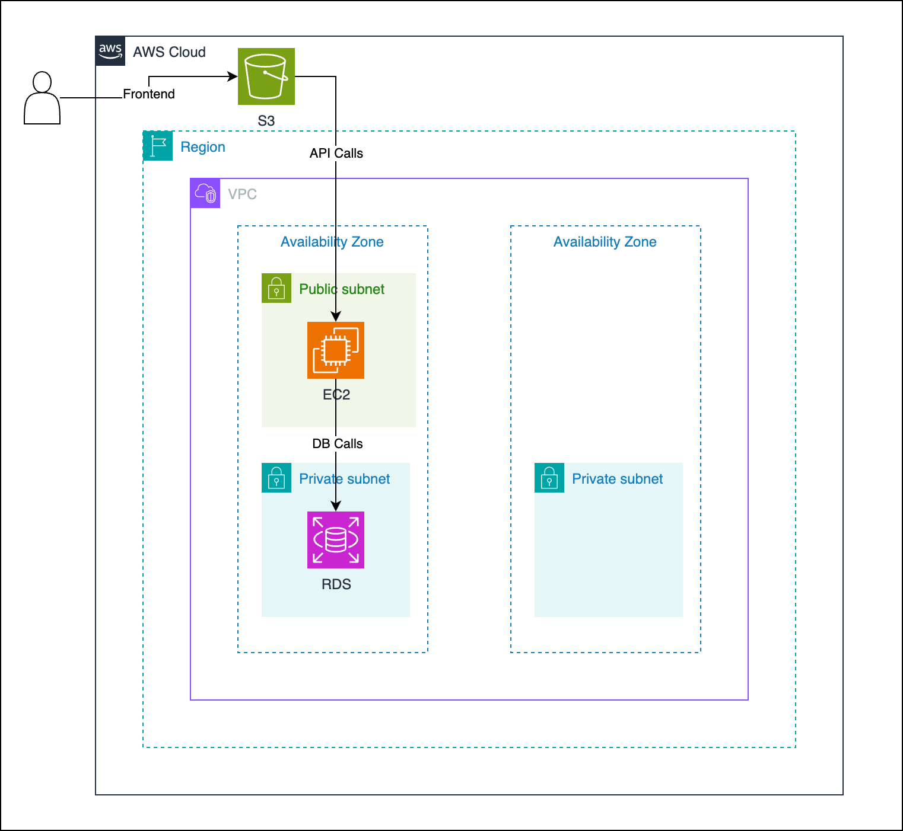

# User Management System

A simple web application demonstrating a basic user management system using AWS free tier services.

## Architecture Overview
The application consists of three main components:
1. Frontend: Static single-page application hosted on S3
2. Backend: FastAPI application running on EC2 (t3.micro)
3. Database: MySQL database on RDS (free tier)

## Architecture Diagram



## Local Development Setup

### Prerequisites
- Python 3.11
- MySQL
- Git
- AWS Account (Free Tier)
- AWS CLI installed and configured
- Terraform installed

### Database Setup
```sql
CREATE DATABASE usersdb;
```

### Backend Setup
```bash
# Clone the repository
git clone https://github.com/sarvajit-sankar/simple-app
cd simple-app/backend

# Create virtual environment
python -m venv venv
source venv/bin/activate  # On Windows: .\venv\Scripts\activate

# Install dependencies
pip install -r requirements.txt

# Set up environment variables
cp .env.example .env
# Update .env with your database credentials

# Run the application
uvicorn app.main:app --reload
```

### Frontend Setup
```bash
# Navigate to frontend directory
cd frontend

# You can simply open index.html in a browser
# Or use Python's built-in server
python -m http.server 3000
```

## AWS Deployment

### Infrastructure
- VPC with public subnet
- EC2 instance (t2.micro) running the FastAPI application
- RDS MySQL instance (free tier)
- S3 bucket for static website hosting
- Security Groups for EC2 and RDS

### Deployment Process
1. Infrastructure is managed using Terraform
2. Frontend is deployed to S3
3. Backend is deployed to EC2
4. Database runs on RDS

### Prerequisites
- AWS Account (Free Tier)
- AWS CLI installed and configured locally
- Terraform installed locally
- Git
- SSH key pair for ec2 access

### Infrastructure Deployment

1. Clone the repository:
```bash
git clone https://github.com/sarvajit-sankar/simple-app
cd simple-app
```

2. Update Terraform variables:
```bash
cd iac
cp terraform.tfvars.example terraform.tfvars
# Edit terraform.tfvars with your values:
# - project_name (e.g., "user-mgmt")
# - environment (e.g., "dev")
# - db_username
# - db_password
```

3. Initialize and apply Terraform:
```bash
terraform init
terraform plan
terraform apply
```

4. Note down the outputs:
```bash
terraform output
# You'll get:
# - backend_public_ip
# - frontend_url
# - db_endpoint
```

### Application Deployment

### Backend Deployment:
```bash
# 1. SSH into EC2 (using the public IP from terraform output)
ssh -i path/to/user-mgmt-key.pem ec2-user@<backend_public_ip>

# 2. Clone and setup application
git clone <repository-url>
cd user-management-system/backend
python3.11 -m venv venv
source venv/bin/activate
pip install -r requirements.txt

# 3. Update environment variables
cp env.example .env
# Edit .env with the RDS endpoint from terraform output

# 4. Start the application
screen -S backend
uvicorn app.main:app --host 0.0.0.0 --port 8000
# Press Ctrl+A+D to detach from screen
```

### Frontend Deployment:
1. Update API endpoint in frontend code:
```bash
cd frontend
# Update API_URL in app.js to point to your EC2 instance IP
```

2. Deploy to S3:
```bash
aws s3 sync . s3://<your-bucket-name>
```

### Cleanup
To avoid any AWS charges, destroy the infrastructure when done:
```bash
cd terraform
terraform destroy
```

## Testing the Application
1. Access the frontend at the S3 website URL (from terraform output)
2. Try creating a new user
3. View the list of users

## API Documentation
Backend API endpoints:

### GET /api/users/
Returns list of all users

Response:
```json
[
  {
    "id": 1,
    "name": "John Doe",
    "email": "john@example.com"
  }
]
```

### POST /api/users/
Create a new user

Request body:
```json
{
  "name": "John Doe",
  "email": "john@example.com"
}
```

## Repository Structure
```
.
├── backend/               # FastAPI application
│   ├── app/
│   │   ├── api/          # API routes
│   │   ├── models/       # Database models
│   │   └── schemas/      # Pydantic schemas
│   └── requirements.txt
├── frontend/             # Static website files
│   ├── index.html
│   ├── styles.css
│   └── app.js
├── terraform/            # Infrastructure as Code
│   ├── main.tf
│   ├── variables.tf
│   └── outputs.tf
└── README.md
```